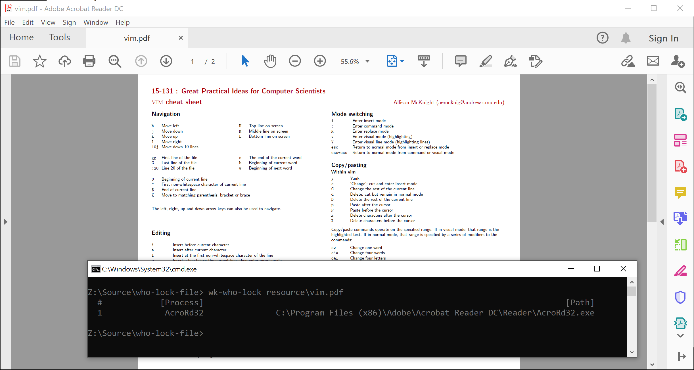

## Who Lock

[](https://github.com/wk-j/who-lock-file/actions)
[](https://www.nuget.org/packages/wk.WhoLock)
[](https://www.nuget.org/packages/wk.WhoLock)

## Usage

```bash
wk-who-lock <FilePath>
```



## Development

```bash
dotnet pack src/WhoLock /p:Version=0.0.1 -o .publish
```